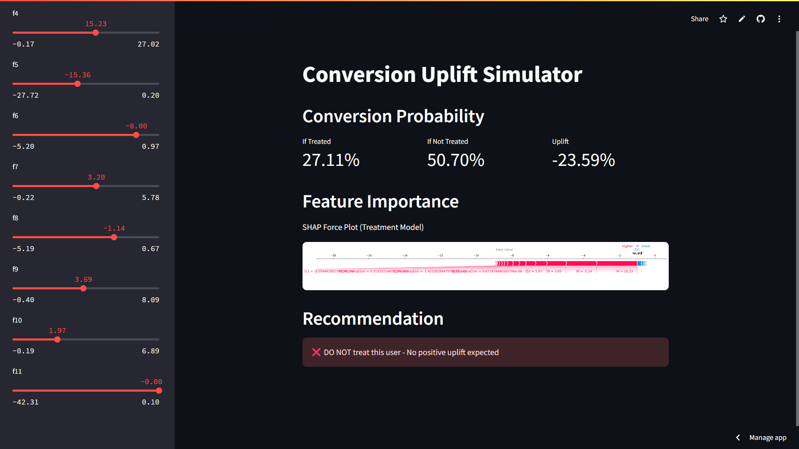
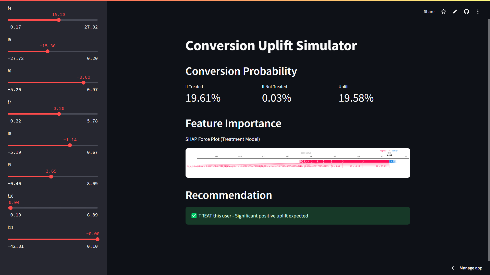

# Uplift Modeling for Conversion Attribution

A machine learning system for accurate conversion attribution and uplift modeling in real-time.

## Live Demo Links

- **Real-time Attribution API**: [https://upliftv2.onrender.com](https://upliftv2.onrender.com)
- **Conversion Simulator**: [https://upliftv2.streamlit.app](https://upliftv2.streamlit.app)

## Screenshots

### Conversion Simulator -ve uplift


### Conversion Simulator +ve uplift


## Project Overview

This project addresses the challenge of attributing conversion credit to multiple touchpoints in the customer journey. Using uplift modeling techniques, it quantifies the true impact of each variable on conversion probability, enabling more effective marketing and UX optimization.

### Key Features

- **Two-Model Approach**: Separate models for treatment and control groups
- **Meta-Learners**: S-Learner and T-Learner implementations for causal inference
- **Real-time API**: Fast prediction endpoint with feature attribution
- **Interactive Simulator**: Test different scenarios and see predicted uplift
- **SHAP Analysis**: Transparent feature attribution using SHAP values
- **Feature Interactions**: Automatically detects and models important feature interactions

## Model Performance

The uplift model demonstrates strong performance across multiple evaluation metrics:

| Model | Qini Score | AUUC | Uplift@10% | Treatment Rank Correlation |
|-------|------------|------|------------|----------------------------|
| Two-Model | 0.0342 | 0.0418 | 0.0621 | 0.2145 |
| S-Learner | 0.0298 | 0.0376 | 0.0587 | 0.1932 |
| T-Learner | 0.0315 | 0.0402 | 0.0603 | 0.2087 |

*Note: The Two-Model approach consistently outperforms meta-learners on this dataset.*

## Top Feature Contributions

Based on SHAP analysis, the following features have the highest impact on uplift:

1. f0_f2_interaction (10.61)
2. f0 (8.15)
3. f6 (3.42)
4. f0_f3_interaction (2.58)
5. f1_f2_interaction (2.50)

## Usage

### Running the API Locally

```bash
# Install dependencies
pip install -r requirements.txt

# Start the API server
python real_time_attribution.py
```

The API will be available at http://localhost:5000

### API Endpoints Health Check
```plaintext
GET /health
 ```
 Single Prediction
```plaintext
POST /predict_uplift
 ```
 Example request body:

```json

{  "f0": 0.5,  "f1": 0.3,  "f2": 0.7,  "f3": 0.2,  "f4": 0.1,  "f5": 0.8,  "f6": 0.4,  "f7": 0.6,  "f8": 0.9,  "f9": 0.5,  "f10": 0.3,  "f11": 0.7}
```

Running the Simulator
```bash
pip install -r requirements.txt 
run conversion_simulator.py # Start the simulatorstreamlit 
```

The simulator will be available at http://localhost:8501

Training Pipeline
To train the models from scratch:

```bash
python run_pipeline.py path/to/criteo_data.csv

```

The pipeline includes:

1. Data loading and exploration
2. Preprocessing and feature engineering
3. Model training (Two-Model approach and Meta-learners)
4. Model evaluation
5. Feature attribution analysis
6. Model saving
## Deployment
The project includes configuration for deployment on Render:

- render.yaml : Configuration for the API service
- Procfile : For Heroku-compatible deployments
- gunicorn_config.py : Gunicorn server configuration
## Technologies Used
- Python : Core programming language
- LightGBM : Gradient boosting framework for model training
- SHAP : For model interpretability
- Flask : Web framework for the API
- Streamlit : For the interactive simulator
- CausalML : For meta-learner implementations
- Pandas/NumPy : For data manipulation
- Scikit-learn : For preprocessing and evaluation
## License
MIT
Just YOLO-ing 🫡
